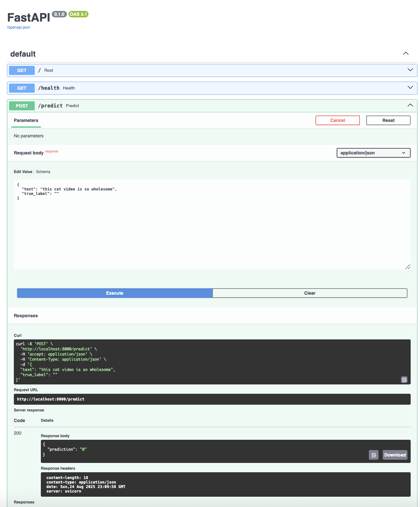
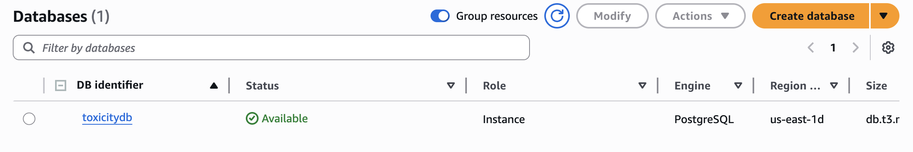
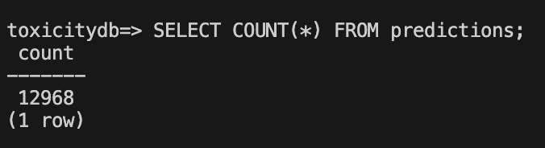
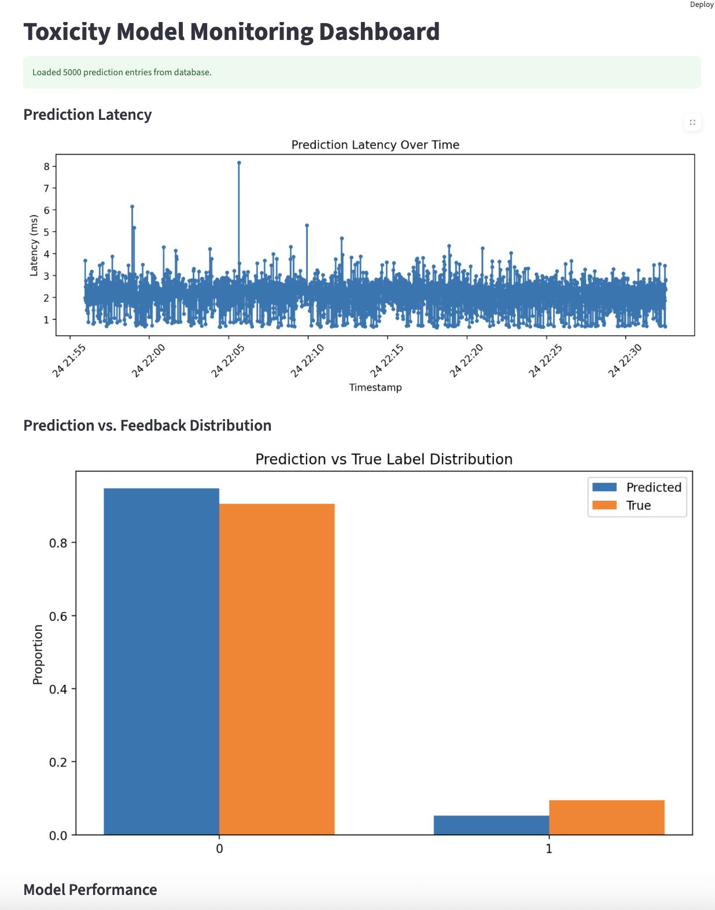
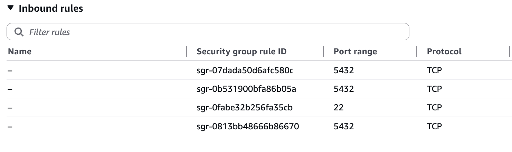
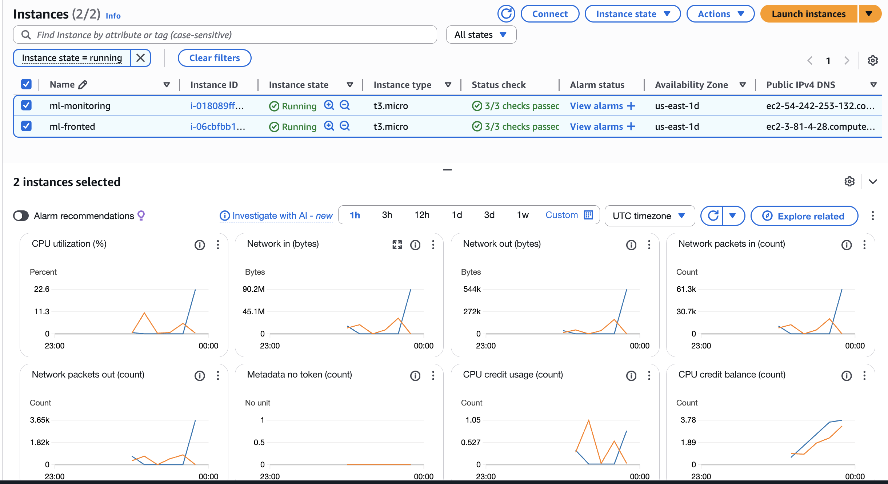
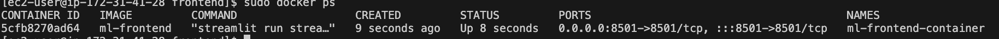
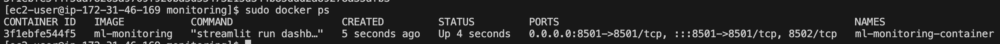

# end-to-end-final

## Project Overview

This project demonstrates a full production-ready machine learning service deployed on AWS infrastructure. It features a modular architecture with multiple components working together to provide model predictions, user interaction, and live monitoring.

The system includes:

- **Experiment Tracking & Model Versioning:** Basic integration for tracking model experiments and managing model versions.
- **ML Model Backend:** A FastAPI service that loads the latest production model and serves prediction requests.
- **Persistent Data Store:** AWS-managed database (RDS) that logs prediction requests and user feedback for monitoring.
- **Frontend Interface:** A user-facing Streamlit application to interact with the model.
- **Model Monitoring Dashboard:** A separate Streamlit dashboard that visualizes model performance, detects data drift, and monitors prediction quality.
- **CI/CD Pipeline:** Automated testing and linting using GitHub Actions to ensure code quality on every pull request.
- **Containerized Deployment:** Each component is containerized with Docker and deployed on separate AWS EC2 instances.


## Architecture
The frontend sends prediction requests to the backend.

The backend serves predictions using the deployed model and logs requests to the database.

The monitoring dashboard queries the database to track metrics such as latency, accuracy, and data drift.

The entire system is containerized and deployed across multiple EC2 instances for scalability and separation of concerns.


---
## Components

### Experiment Tracking & Model Versioning

- Log model training experiments with key metrics and hyperparameters.
- Save models and manage basic versioning via a model registry tool.

### FastAPI Backend

- Serves `/predict` endpoint to provide model predictions.
- Implements `/health` endpoint for status checks.
- Connects to AWS-managed database to log all prediction requests and user feedback.
- Supports caching of frequent predictions.



### RDS Instance




### Frontend Interface

- Streamlit application allowing users to input data and receive predictions.
- Provides an interactive, easy-to-use interface for model interaction.

### Model Monitoring Dashboard

- Streamlit dashboard deployed separately.
- Connects to the database to visualize:
  - Prediction latency over time.
  - Target and data distribution drifts.
  - Live model accuracy based on user feedback.
  - Alerts on performance degradation.




### CI/CD Pipeline

- GitHub Actions workflow automates:
  - Code linting (using flake8).
  - Running unit and integration tests via pytest.
- Ensures only quality code is merged into the main branch.

### Containerization & Deployment

- Each component is packaged into a Docker container.
- Backend, frontend, and monitoring dashboard run on separate AWS EC2 instances.
- Uses Docker volumes and environment variables for configuration and data persistence.

## Setup & Deployment Instructions

### Prerequisites

- AWS account with permissions to create EC2 instances, RDS/DynamoDB, and Security Groups.
- SSH key pair (.pem file) for EC2 access.
- Docker installed locally for building images (optional).

### EC2 Instance Setup

1. Launch EC2 instances for frontend, backend, and monitoring dashboard.
2. Configure security groups to allow:
   - Port 22 for SSH (restricted to your IP).
   - Port 8000 for FastAPI backend.
   - Port 8501 for Streamlit frontend and monitoring dashboards.




3. SSH into each instance using your `.pem` key.

### Installing Dependencies

On each EC2 instance:

```bash
sudo dnf update -y
sudo dnf install -y docker git
sudo systemctl start docker
sudo systemctl enable docker
```

The project repo was cloned and then docker containers were created and run for each of the two instances

```bash

docker build -t <component-name> .
docker run -d -p <port>:<port> --name <container-name> --env-file .env <component-name>

```








## CI/CD Pipeline

- Configured with GitHub Actions to automate testing and linting on pushes.
- Ensures that only passing, high-quality code is merged.

I used these commands to test and reformat the code locally too:
```bash
flake8 .
black .
```
